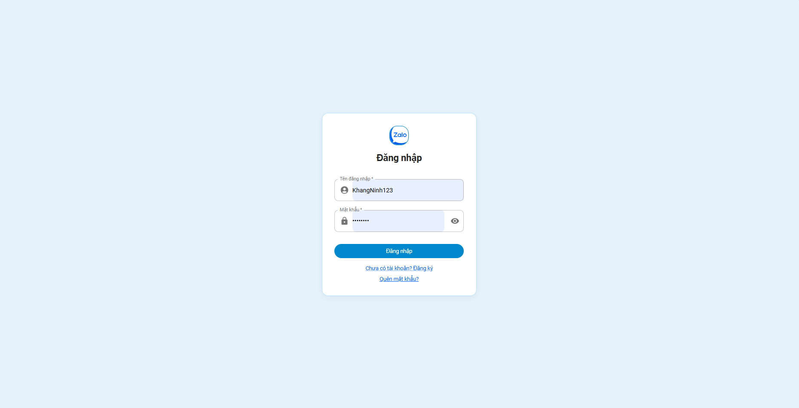
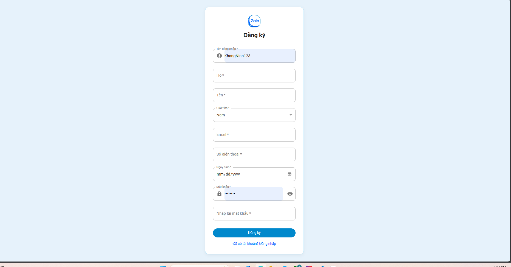
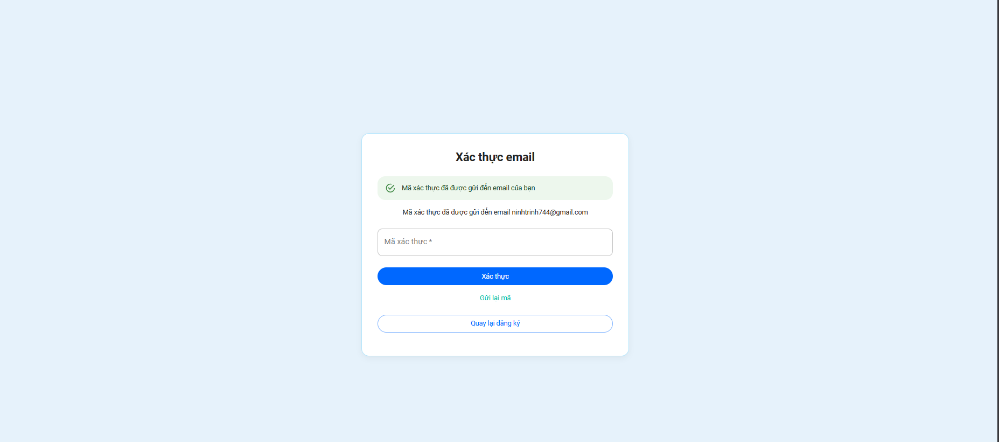

# Zalo Clone 🚀

Zalo Clone là một ứng dụng nhắn tin thời gian thực (real-time chat app) lấy cảm hứng từ nền tảng Zalo. Dự án được xây dựng nhằm mục tiêu thực hành các công nghệ fullstack hiện đại, kết hợp giữa React, Spring Boot và WebSocket.

## 🔧 Công nghệ sử dụng

### 🖥 Backend
- **Spring Boot 3** – Xây dựng RESTful API
- **Spring Security + JWT** – Xác thực và phân quyền
- **WebSocket (STOMP)** – Giao tiếp thời gian thực
- **Redis** – Quản lý token & Pub/Sub
- **MongoDB** – Lưu trữ dữ liệu người dùng và tin nhắn
- **Cloudinary** – Lưu trữ và phân phối ảnh

### 💻 Frontend
- **React.js + TypeScript** – Giao diện hiện đại, dễ mở rộng
- **Socket.IO** – Kết nối thời gian thực
- **Axios** – Giao tiếp với API
- **Material UI (MUI)** – Giao diện trực quan, responsive

---

## 💡 Các tính năng nổi bật

- ✅ Đăng ký / Đăng nhập (JWT + Refresh Token)
- ✅ Xác thực và phân quyền người dùng
- ✅ Kết bạn, tìm kiếm người dùng
- ✅ Nhắn tin văn bản & hình ảnh thời gian thực
- ✅ Gửi emoji, tạo nhóm chat
- ✅ Xem lịch sử trò chuyện
- ✅ Hiển thị trạng thái online
- ✅ Quản lý ảnh đại diện qua Cloudinary

---

## 📁 Cấu trúc thư mục

### Backend
```
src/
├── controller/
├── service/
├── repository/
├── security/
├── config/
└── model/
```

### Frontend
```
src/
├── components/
├── pages/
├── services/
├── contexts/
└── utils/
```

---

## ⚙️ Môi trường phát triển

- Java 17+
- Node.js 18+
- Docker (tùy chọn)
- MongoDB (có thể dùng Docker hoặc local install)

---

## 🚀 Cài đặt và chạy project

### 1. Clone dự án
```bash
git clone https://github.com/luongtandat03/Zalo_Clone.git
```

### 2. Cấu hình biến môi trường

#### Backend (.env)
```env
CLOUDINARY_CLOUD_NAME=your_cloud_name
CLOUDINARY_API_KEY=your_api_key
CLOUDINARY_API_SECRET=your_api_secret
JWT_SECRET=your_jwt_secret
```

#### Frontend (.env)
```env
VITE_API_BASE_URL=http://localhost:8080/api
```

### 3. Khởi động backend
```bash
cd backend
./mvnw spring-boot:run
```

### 4. Khởi động frontend
```bash
cd frontend
npm install
npm run dev
```

---

## 📸 Giao diện demo

### 🔐 Màn hình đăng nhập


### 🔐 Màn hình đăng kí


### 💬 Giao diện chat


### Màn hình xác minh email



### Màn hình thông tin người dùng


---

## 🎯 Mục tiêu cá nhân

> Đây là dự án cá nhân với mong muốn:
> - Thành thạo kiến trúc client-server
> - Làm chủ quy trình xác thực với JWT và real-time chat
> - Nâng cao kỹ năng triển khai hệ thống microservice đơn giản
> - Là nền tảng để phát triển thêm các dự án lớn hơn trong tương lai

---

## 🤝 Hướng dẫn đóng góp

Mọi đóng góp đều được hoan nghênh! Bạn có thể:
1. Fork repository
2. Tạo nhánh mới (`git checkout -b feature/ten-tinh-nang`)
3. Commit & push
4. Mở Pull Request

---

## 📬 Liên hệ

- 💻 GitHub: [@luongtandat03](https://github.com/luongtandat03)
- 📧 Email: luongtandat512@gmail.com

---

⭐ Nếu bạn thấy dự án hữu ích, hãy nhấn nút **Star** để ủng hộ mình nhé!
